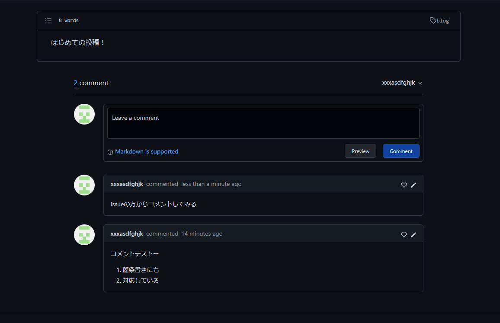

このGitHubのhugoテーマではオプションでgitalkが使えるようです。

[これ](https://github.com/gitalk/gitalk)を見ながらレポジトリを作成・アプリ設定をすると有効化できました。

試しにgitalkを使ってコメントを投稿すると、登録しておいたレポジトリのissueにコメントためられていました。DBいらず。

issueのコメントと同期していて、issueの方でコメントしても記事の方に反映されてました。
